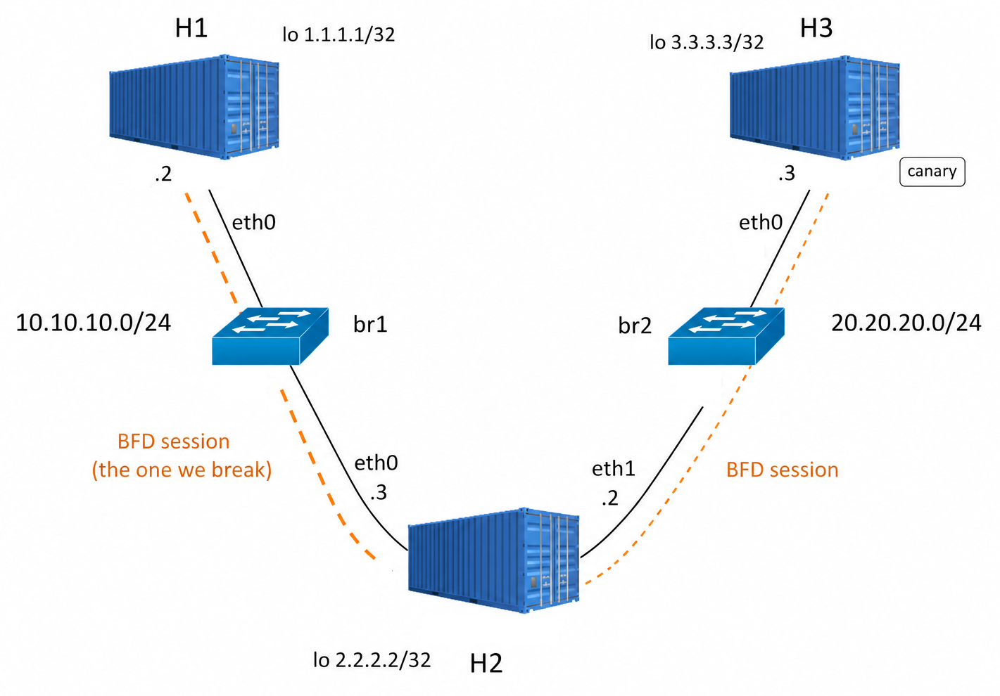
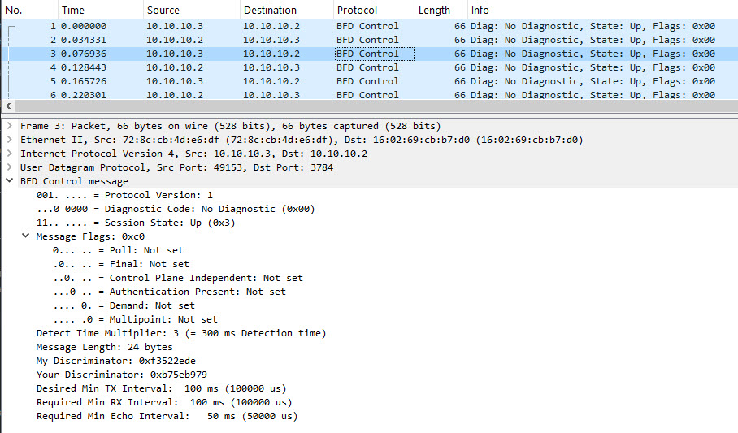

# BFD Lab

A hands-on lab for learning [Bidirectional Forwarding Detection (BFD)](https://datatracker.ietf.org/doc/html/rfc5880) with [FRRouting (FRR)](https://frrouting.org/) inside Docker containers. It uses the same three-node OSPF topology as [FRR-LabNet](https://github.com/ManiAm/FRR-LabNet), then adds BFD so you can observe the difference between sub-second failure detection and the 40-second wait that OSPF would require on its own.

The setup is fully automated: build one Docker image, bring up the containers, and both OSPF and BFD come up by themselves.

> For BFD packet format, state machine, timers, and advanced variants see [BFD.md](BFD.md).

## Prerequisites

- **Docker Engine** (v20.10 or later) with the `docker compose` plugin.
- Basic familiarity with the Linux command line.
- No physical routers or switches are needed.

If FRR-LabNet is still running, stop it first. Both labs use containers named `H1`, `H2`, and `H3`.

## Key Concepts

### Why routing timers are slow

Routing protocols such as OSPF and BGP detect neighbor failure through periodic Hello or Keepalive packets. If a router stops receiving these packets after a defined interval (the "dead" or "hold" timer), it assumes the neighbor has failed and recalculates routes.

| Protocol | Default Hello | Default Dead / Hold | Typical Detection Time |
| -------- | ------------- | ------------------- | ---------------------- |
| OSPF     | 10 s          | 40 s                | 40 s                   |
| BGP      | 60 s          | 180 s               | 180 s                  |

These timers are intentionally conservative. Lowering them to sub-second intervals would force the control-plane CPU to process complex Hello packets across many neighbors multiple times per second, risking CPU exhaustion and false failures when the processor is temporarily busy with legitimate work such as recalculating routes.

BFD was designed so the routing protocol can keep its slow, safe timers while a lightweight detector watches the forwarding path at high speed. See [The Problem with Traditional Routing Convergence](BFD.md#the-problem-with-traditional-routing-convergence) for the full breakdown.

### What BFD is

BFD is a Layer 3, UDP-based liveness protocol defined in [RFC 5880](https://datatracker.ietf.org/doc/html/rfc5880) standard. It sends a compact 24-byte control packet at a negotiated interval and declares the session **Down** after a small number of consecutive misses. The detection time is:

**detect-multiplier × interval**

For the settings in this lab (multiplier 3, interval 100 ms):

**3 × 100 ms = 300 ms**

BFD does not install routes or compute paths. It only answers one question: *is this forwarding path alive?* A routing protocol that has registered with BFD — meaning it has asked BFD to monitor a specific neighbor — uses that answer to drop the neighbor and recompute routes immediately, rather than waiting for its own dead timer.

BFD is also **protocol-independent**. The control packets, the UDP port (3784), and the state machine are identical regardless of whether OSPF, BGP, or IS-IS is listening. The routing protocol only determines:

- **Who gets notified** when BFD declares the path Down.
- **How slow the fallback** would be without BFD (each protocol's own dead/hold timer).

This lab uses OSPF because the topology already runs it, and because `ip ospf bfd` creates a BFD session automatically when an OSPF neighbor appears. You could repeat the same experiment with BGP; BFD would behave exactly the same.

### Silent failure

BFD is most valuable when a **local interface stays up** but packets stop arriving. Common causes include a far-end crash, a fiber cut somewhere along the path, or a hardware fault that drops traffic while the electrical signal persists. In all of these cases the surviving router's NIC remains up, so the kernel has nothing to report. Without BFD, the only indication is the absence of Hello packets — and the routing protocol will not notice until its own dead timer expires (40 seconds for OSPF, up to 180 seconds for BGP).

## Lab Topology

The lab creates three containers connected by two Docker bridge networks. Addresses are fixed so the examples below match what you see.



| Container | Bridge Networks | Interfaces | Addresses | Loopback |
| --------- | --------------- | ---------- | --------- | -------- |
| **H1** | `br1` only | `eth0` | 10.10.10.2/24 | 1.1.1.1/32 |
| **H2** | `br1` and `br2` | `eth0`, `eth1` | 10.10.10.3/24, 20.20.20.2/24 | 2.2.2.2/32 |
| **H3** | `br2` only | `eth0` | 20.20.20.3/24 | 3.3.3.3/32 |

- **H1** and **H3** cannot reach each other directly.
- **H2** is multi-homed and forwards between the two subnets once OSPF converges.
- Each OSPF adjacency has a BFD session. The experiment breaks the H1–H2 session.

**Loopback addresses** (e.g. `1.1.1.1/32`) are virtual interfaces that stay up as long as the router is running. Routing protocols advertise them so other routers can reach them. Pinging a loopback proves that the routing path is working, not just the directly connected link.

### The canary router

BFD only needs two nodes on one link. H3 is not required to form a BFD session.

| Node | Role |
| ---- | ---- |
| **H1 ↔ H2** | The BFD session you break. |
| **H3 (`3.3.3.3`)** | The canary prefix. When BFD tells OSPF that H2 is gone, this route vanishes from H1. |

Two containers would show `show bfd peers` and "OSPF neighbor Down." Three containers also show "I can no longer reach the far side of the network" — the same end-to-end ping used in FRR-LabNet.

### How the lab creates a silent failure

The experiment takes down **H2's** `eth0` inside its own container. H1's `eth0` remains up. From H1's point of view the cable still looks fine; only missing BFD packets (or, without BFD, missing OSPF Hellos after ~40 seconds) reveal that H2 is gone.

Do not take down H1's own `eth0`. The kernel would report that failure instantly, OSPF would react without BFD, and the experiment would prove nothing about BFD's value.

## What This Lab Demonstrates

You will run the same link failure twice and compare the results:

| Run | BFD registered with OSPF | H1 loses `3.3.3.3` |
| --- | --- | --- |
| **With BFD** (default) | yes | ~**300 ms** |
| **Without BFD** | no | ~**40 s** (OSPF dead timer) |

When BFD is registered with OSPF and the session goes Down, OSPF tears down the neighbor immediately instead of waiting for its own dead timer. The far-side prefix (`3.3.3.3`) disappears from H1, and the ping fails. That side-by-side comparison is the point of the lab.

## Quick Start

Build the Docker image:

```bash
docker build --tag frr-bfd docker/
```

Start the containers:

```bash
docker compose -f docker/docker-compose.yml up -d
```

OSPF on a Docker bridge uses the broadcast network type, which includes a Wait timer that can keep the adjacency in **2-Way** for up to ~40 seconds before it reaches **Full**. BFD sessions typically come up within a few seconds, well before OSPF finishes forming the adjacency. This is expected: BFD is an independent detector and does not depend on the routing protocol's state.

Wait until H1 shows a Full neighbor and a route to `3.3.3.3`, then continue at [Verify the Lab](#verify-the-lab).

## How the Lab Works

### Startup

The entrypoint script enables IP forwarding (`net.ipv4.ip_forward=1`), copies the FRR configuration that matches the container's hostname, and starts FRR. FRR launches three daemons:

- **`zebra`** — the route manager that installs routes into the kernel.
- **`ospfd`** — the OSPF routing daemon.
- **`bfdd`** — the BFD daemon.

The configuration files live under `docker/configs/`:

```
docker/configs/
├── daemons              # shared — enables ospfd and bfdd
├── frr-h1/frr.conf      # loopback 1.1.1.1, OSPF+BFD on br1
├── frr-h2/frr.conf      # loopback 2.2.2.2, OSPF+BFD on both bridges
└── frr-h3/frr.conf      # loopback 3.3.3.3, OSPF+BFD on br2
```

Each host defines a BFD profile named `fast` (100 ms interval, multiplier 3) and enables BFD for OSPF on its data interfaces:

```
bfd
 profile fast
  detect-multiplier 3
  receive-interval 100
  transmit-interval 100
 !
interface eth0
 ip ospf bfd
 ip ospf bfd profile fast
```

OSPF creates the BFD peer automatically when it detects a neighbor. You do not configure neighbor addresses by hand.

### Modifying the configuration

Edit the files under `docker/configs/`, rebuild the image, and recreate the containers:

```bash
docker build --tag frr-bfd docker/
docker compose -f docker/docker-compose.yml up -d
```

Live changes made through `vtysh` are lost when the container restarts. `vtysh` is FRR's command-line shell, similar to a Cisco IOS CLI — you access it with `docker exec -it H1 vtysh`.

## Verify the Lab

### OSPF adjacency

Confirm the adjacency is **Full** before checking anything else. OSPF adjacencies progress through several states — **Down → Init → 2-Way → Full** — and on broadcast networks (like Docker bridges), the protocol elects a Designated Router (DR) after reaching 2-Way. This election can keep the state at 2-Way for up to ~40 seconds. Only when the state shows **Full** are routes being exchanged.

```bash
docker exec H1 vtysh -c "show ip ospf neighbor"
```

```
Neighbor ID     Pri State           Up Time         Dead Time Address         Interface
2.2.2.2           1 Full/DR         23s               36.550s 10.10.10.3      eth0:10.10.10.2
```

H1's only OSPF neighbor is H2 (`2.2.2.2`), and it is the DR on this broadcast segment.

### BFD sessions

```bash
docker exec H1 vtysh -c "show bfd peers"
```

H1 should have one session, toward H2, in state **up**:

```
BFD Peers:
	peer 10.10.10.3 local-address 10.10.10.2 vrf default interface eth0
		Status: up
		Peer Type: dynamic
		Profile: fast
		Local timers:
			Detect-multiplier: 3
			Receive interval: 100ms
			Transmission interval: 100ms
			Detection timeout: 300ms
```

`Peer Type: dynamic` means OSPF created the session automatically. `Detection timeout: 300ms` is the `fast` profile (3 × 100 ms).

H2 has two sessions (H1 on `eth0`, H3 on `eth1`):

```bash
docker exec H2 vtysh -c "show bfd peers brief"
```

```
Session count: 2
SessionId  LocalAddress   PeerAddress   Status  Profile
4082249438 10.10.10.3     10.10.10.2    up      fast
2793078861 20.20.20.2     20.20.20.3    up      fast
```

### The canary route

```bash
docker exec H1 vtysh -c "show ip route 3.3.3.3"
```

```
Routing entry for 3.3.3.3/32
  Known via "ospf", distance 110, metric 20, best
  * 10.10.10.3, via eth0, weight 1
```

The canary prefix `3.3.3.3/32` is an OSPF route reachable through H2 (`10.10.10.3`). When H2 disappears, this route will be the first visible casualty.

### End-to-end ping

Ping the loopbacks that OSPF advertises, sourced from the local loopback:

```bash
docker exec H1 ping -c 3 -I 1.1.1.1 3.3.3.3
docker exec H3 ping -c 3 -I 3.3.3.3 1.1.1.1
```

Both should succeed: **H1 → H2 → H3**. This is the same reachability check as FRR-LabNet. The `-I` flag sets the source to the loopback address rather than the Docker bridge address, so the packet is routed through H2 the way a real router would forward it.

### Capture BFD on the wire

BFD single-hop control packets use **UDP port 3784**. Leave this running in a separate terminal:

```bash
docker exec H1 tcpdump -n -i eth0 udp port 3784
```

```
IP 10.10.10.3.49153 > 10.10.10.2.3784: BFDv1, Control, State Up, Flags: [none], length: 24
IP 10.10.10.2.49152 > 10.10.10.3.3784: BFDv1, Control, State Up, Flags: [none], length: 24
```

You should see a packet in each direction approximately every 100 ms. `BFDv1`, 24 bytes, **UDP/3784** — this is BFD traffic, not OSPF (which uses IP protocol 89, not UDP).



## Experiment: With BFD vs Without BFD

Use two terminals. Terminal A watches H1. Terminal B injects the failure.

### Terminal A — watch H1

```bash
docker exec -it H1 bash -c 'while true; do
  echo "===== $(date +%H:%M:%S.%3N) ====="
  vtysh -c "show bfd peers brief"
  vtysh -c "show ip ospf neighbor"
  ip route show 3.3.3.3
  echo
  sleep 0.2
done'
```

### Run 1 — with BFD (the default)

In Terminal B, take down **H2's** `eth0`. H1's interface stays up.

```bash
docker exec H2 ip link set eth0 down
```

On H1, within about **300–400 ms**:

1. The BFD session disappears (`show bfd peers brief` is empty).
2. The OSPF neighbor toward H2 disappears.
3. `ip route show 3.3.3.3` is empty — the canary is gone.

Ping now fails:

```bash
docker exec H1 ping -c 3 -W 1 -I 1.1.1.1 3.3.3.3
```

BFD detected the silent failure and notified OSPF. OSPF did not wait 40 seconds.

### Restore the link

```bash
docker exec H2 ip link set eth0 up
```

Wait until BFD is **up**, the OSPF neighbor is Full, and `ping -I 1.1.1.1 3.3.3.3` works again (typically 10–20 seconds). Confirm before starting Run 2.

### Run 2 — without BFD

Remove BFD from the H1–H2 OSPF adjacency so that BFD no longer notifies OSPF on this link:

```bash
docker exec H1 vtysh -c "configure" -c "interface eth0" -c "no ip ospf bfd"
docker exec H2 vtysh -c "configure" -c "interface eth0" -c "no ip ospf bfd"
```

Confirm that H1 has no BFD peer and that OSPF and the canary route are still up:

```bash
docker exec H1 vtysh -c "show bfd peers brief"
docker exec H1 vtysh -c "show ip ospf neighbor"
docker exec H1 ping -c 1 -I 1.1.1.1 3.3.3.3
```

Start the watcher in Terminal A again, then cut the same link:

```bash
docker exec H2 ip link set eth0 down
```

This time:

1. There is no BFD session (`Session count: 0`).
2. The OSPF neighbor stays **Full** and `3.3.3.3` remains in the routing table.
3. Watch the **Dead Time** column count down from ~40 seconds. When it reaches zero, the neighbor disappears and the canary route is removed.

Same failure, same topology. The only difference is whether OSPF was registered with BFD.

| Run | Time until `3.3.3.3` leaves H1 |
| --- | --- |
| With BFD | ~300 ms |
| Without BFD | ~40 s (OSPF dead timer) |

### Restore and re-enable BFD

```bash
docker exec H2 ip link set eth0 up
docker exec H1 vtysh -c "configure" -c "interface eth0" -c "ip ospf bfd" -c "ip ospf bfd profile fast"
docker exec H2 vtysh -c "configure" -c "interface eth0" -c "ip ospf bfd" -c "ip ospf bfd profile fast"
```

Or recreate the containers from the original configuration:

```bash
docker compose -f docker/docker-compose.yml up -d --force-recreate
```

## Cleanup

```bash
docker compose -f docker/docker-compose.yml down
```
